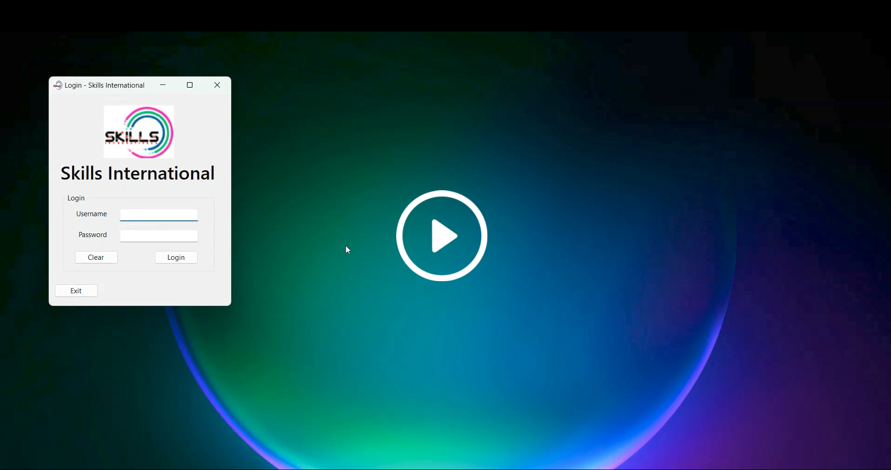
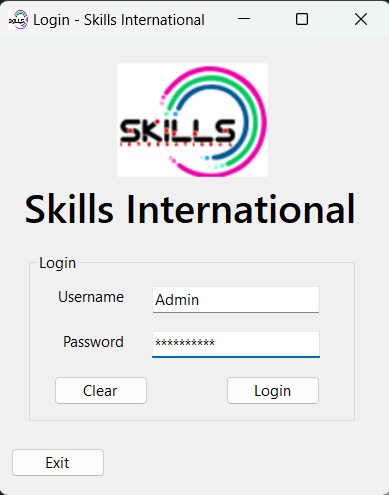
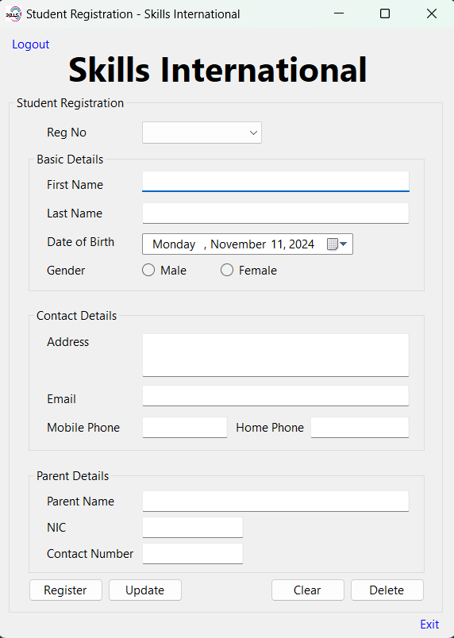
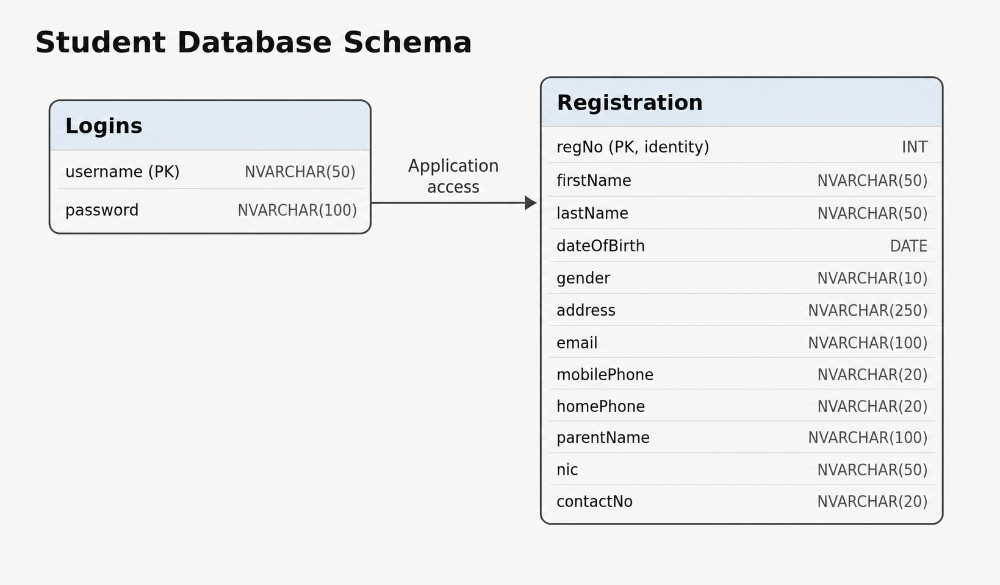

# Skills International Student Registration System

A C# Windows Forms application for authenticated, database student registration and record management with Microsoft SQL Server.

[](https://youtu.be/F24xseEAizM)

## Features

- Database-backed login.
- Create, search, update, clear, and delete student registrations.
- Store personal, contact, and parent details in a relational database.
- Validate required fields, email addresses, phone numbers, gender, and date of birth.

## Run

Requirements: Windows, Visual Studio 2022 with the .NET desktop workload, .NET 6, and SQL Server LocalDB or SQL Server Express.

1. Run `database/setup.sql` in SQL Server Management Studio or Azure Data Studio.
2. Open `SkillsInternationalSchool.sln` and restore NuGet packages.
3. Start the application.

Demonstration login:

```text
Username: Admin
Password: Skills@123
```

The default connection uses `(localdb)\MSSQLLocalDB`. For another SQL Server instance, set `SKILLS_SCHOOL_DB_CONNECTION` before launching the application.

## Screens






